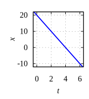
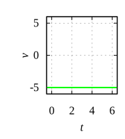
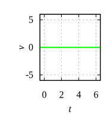

# graph_xvat_eg_1
$$
x_0 = 10, \ \ \ \ t_0 = 2

$$

$v_0 = -5$ | $v_0 = 0$ | $v_0 = 5$
:-: | :-: | :-:
 |  | 
 |  | 
 |  | 


```shell
$ ../../../../../scripts/mdgnu.sh graph_xvat_eg.md
```


```bash
set term svg size 180,200 font "Times, 16" enhanced
set grid
set tics scale 0.4
set xlabel "{/Times:Italic t}" offset 0, 0.5
set xrange [0:6]
set ylabel '' offset 2
set lmargin 6
set rmargin 1

rcolor = '#0000ff'
vcolor = '#00ff00'
acolor = '#ff0000'

x_0 = 10
t_0 = 2
set xrange [-0.5:6.5]
set xtics 2

do for [i = 1:3] {
  j = -5 + 5*(i - 1)
  
  v_0 = j
  r(t) = x_0 + v_0 * (t - t_0)
  v(t) = v_0
  a(t) = 0
  
  num = i
  
  set output 'xt'.num.'.svg'
  set ylabel "{/Times:Italic x}"
  set yrange [-12:22]
  set ytics 10
  plot r(x) t '' w l lw 2 lc rgb rcolor

  set output 'vt'.num.'.svg'
  set ylabel "{/Times:Italic v}"
  set yrange [-6:6]
  set ytics 5
  plot v(x) t '' w l lw 2 lc rgb vcolor

  set output 'at'.num.'.svg'
  set ylabel "{/Times:Italic a}"
  set yrange [-1.2:1.2]
  set ytics 1
  plot a(x) t '' w l lw 2 lc rgb acolor
}

```
